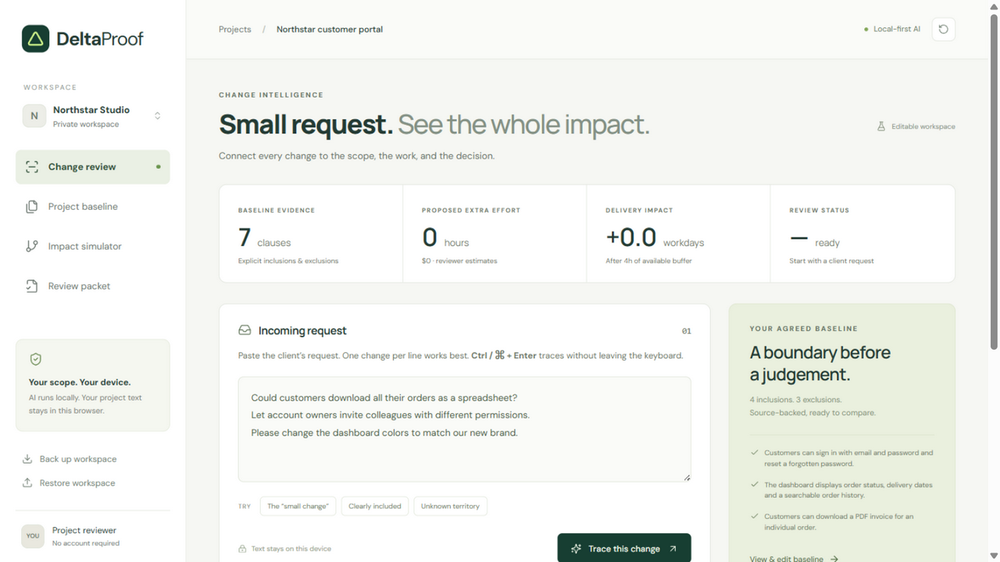

# DeltaProof

**See what a small change really changes.**

A private AI scope-review workspace for small software agencies. Paste a client request, retrieve the exact related scope clauses, review the decision, and compare its effect on dependent work before exporting an internal proposal.

[Open the demo](https://deltaproof.vercel.app) · [Source repository](https://github.com/sgoel2be24-cyber/deltaproof) · [Deck](artifacts/DeltaProof.pptx) · [Captioned walkthrough](artifacts/DeltaProof-demo.mp4)

[](https://github.com/sgoel2be24-cyber/deltaproof/actions/workflows/check.yml)



## Try it locally

Requires Node.js 22+ and npm. No API key, database, account or paid service.

```sh
npm ci
npm run models
npm run dev
```

Open the URL printed by Vite. The model setup downloads a quantized MiniLM model from Hugging Face. Model files remain on your machine and are served with the app. The app prepares the model in the background while you read, so the first trace usually needs no wait. Project text is processed inside a browser worker and never sent to an AI API. No third-party requests occur at runtime; fonts are served locally. Local browser storage is not encrypted.

```sh
npm test          # deterministic rules, validation, simulation and export
npm run eval     # actual CPU model inference, writes docs/evaluation.json
npm run build    # TypeScript check and production bundle
npm run preview  # serve the production build
```

## Performance notes

- The inference worker stays warm between reviews. Editing a request or re-tracing reuses the loaded model and its embedding cache instead of restarting the worker; only in-flight jobs are cancelled when inputs change.
- The model is prepared in the background as soon as a real visitor shows presence (pointer, key or touch) — automated audits, crawlers and `Save-Data` or 2G connections never pay the ~45 MB download. On a warm model a three-request trace completes in about 0.3–0.5 s.
- The dev server and production deployment send `Cross-Origin-Opener-Policy: same-origin` and `Cross-Origin-Embedder-Policy: require-corp`. With that isolation, ONNX Runtime Web runs multi-threaded WASM (up to four threads); without it, inference falls back to a single thread.
- Model and runtime assets are cached (`/models` with stale-while-revalidate, `/fonts` immutable), so repeat visits skip most of the download.
- Fonts are self-hosted (DM Sans and Manrope, SIL OFL) and preloaded: no third-party request at runtime and no flash of unstyled text.
- Lighthouse (headless Chromium against the production build): **100 Performance, 100 Accessibility, 100 Best Practices, 100 SEO**. The full muted-text palette meets WCAG AA contrast.
- Device choice is benchmark-driven, not fashionable: in a headless-Chrome harness (`bench.html`), quantized WebGPU inference was ~13× slower than multi-threaded WASM (1.45 s vs 0.11 s for the 19-text seed workload) and numerically divergent, so the app stays on multi-threaded WASM q8. Long findings lists render with `content-visibility`, and the packet view has print styles for clean PDF export.

## Three-minute walkthrough

1. Keep the sample request and click **Trace this change**. All example data is synthetic.
2. Inspect the spreadsheet request: related invoice inclusion and export exclusion conflict, so the app asks for clarification. Read SOW-04 and explicitly choose **Propose a change**.
3. Enter **12 hours**, choose **Order data layer**, and record why the exclusion applies.
4. For team invitations, propose **20 hours** against **Identity & access**. Mark the color request as **Within agreed scope** after reviewing SOW-06. The model may abstain on this request because its similarity is below threshold.
5. Open **Impact simulator**. The proposal is **32 hours / $2,880**. Under the sample parallel schedule, both changes produce **one working day** of delay after the four-hour buffer. Equal delay does not mean equal effort: parallel paths overlap.
6. Defer team invitations. The proposal drops to **12 hours / $1,080**. Toggle again to restore it.
7. Hide SOW-05 in **Challenge the evidence** to inspect recommendation sensitivity. This filters retrieved evidence only and never overwrites the original review.
8. Export **Review packet** as Markdown. No client message or approval occurs.

## What AI does

`Xenova/all-MiniLM-L6-v2` produces normalized 384-dimensional sentence embeddings using quantized ONNX inference through Transformers.js. Cosine similarity retrieves the three most related baseline clauses. A deterministic policy distinguishes weak evidence, conflicting related clauses, a related inclusion and a related exclusion. Every result requires human interpretation.

Similarity does **not** prove entailment, detect every exception, or determine contractual scope. Quantities, negations and mixed requests can confuse the model. Estimates come from the reviewer. The app intentionally preserves uncertain outcomes rather than converting them into approvals.

## What ships

- Editable baseline with validated clauses, estimates and acyclic dependencies
- Local semantic inference in a worker, capped cache and error recovery
- Exact source citations and transparent relevance scores
- Explicit review decisions and reviewer notes
- Dependency simulation with reversible deferral
- Evidence-removal sensitivity inspection
- Browser persistence, baseline/request backups and Markdown review export (or one-click copy)
- `Ctrl/⌘+Enter` traces a request without leaving the keyboard
- Responsive, keyboard-accessible interface with reduced-motion support
- Tests, model smoke evaluation, build documentation and submission materials

## Evaluation

The first 12-case synthetic development smoke set matched the expected top source or abstention in **10/12 cases**. The spreadsheet request retrieved a nearby inclusion above the intended exclusion and correctly entered the conflict branch. The color paraphrase fell below the relevance threshold. This is neither an independent benchmark nor an accuracy claim for real contracts. See [results](docs/evaluation.json).

## Deployment

Vercel settings are included. Build runs `npm run models && npm run build`, output `dist`. The model and runtime add roughly 45 MB of static assets. No server-side API is deployed. Use HTTPS for Web Crypto and worker support. The free deployment requires no secret configuration.

## Limits and boundaries

Single browser workspace, no collaborative approvals or server sync. Browser storage can be cleared and is visible to people with device access. Backups currently preserve baseline and request; export the Markdown packet to preserve the reviewed proposal outside the browser. A SHA-256 input digest identifies the input version, not a digital signature or proof against tampering. English short-form clauses only. At most 50 clauses, 40 tasks and 12 request lines. Simulation assumes unlimited staff across independent tasks, working-hour arithmetic and equal effort splitting. No holidays, capacity constraints or legal interpretation.

## Documentation

- [Architecture and decisions](docs/ARCHITECTURE.md)
- [Hackathon research](docs/HACKATHON.md)
- [Devpost draft](docs/DEVPOST.md)
- [Demo script](docs/DEMO.md)
- [Verification](docs/VERIFICATION.md)
- A local CONTINUE.md checkpoint preserves build state outside version control.

Model attribution: [MiniLM ONNX model](https://huggingface.co/Xenova/all-MiniLM-L6-v2), Apache-2.0. [Original sentence-transformers model](https://huggingface.co/sentence-transformers/all-MiniLM-L6-v2). See [third-party notices](THIRD_PARTY_NOTICES.md). App code: MIT.
